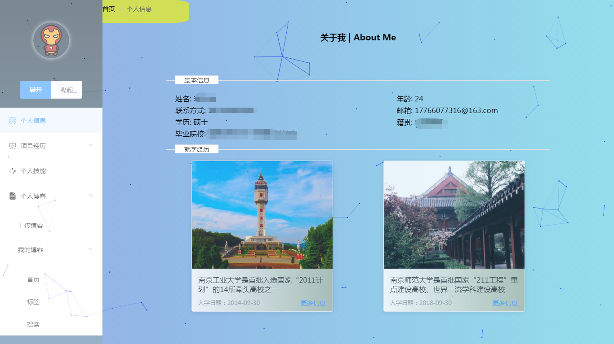
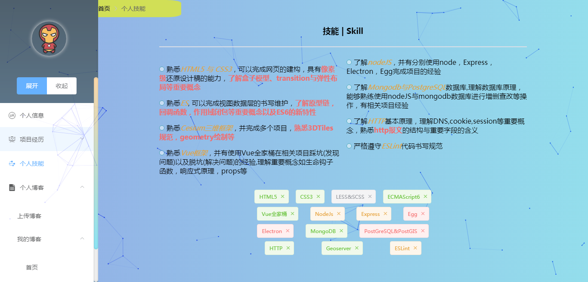
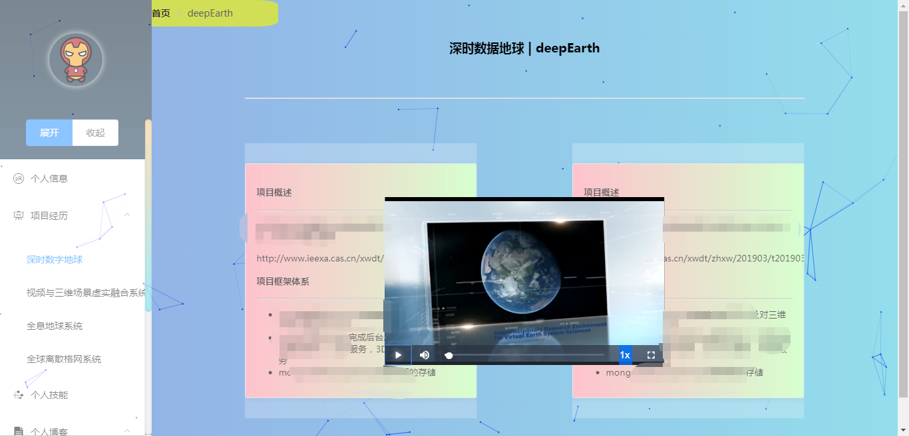
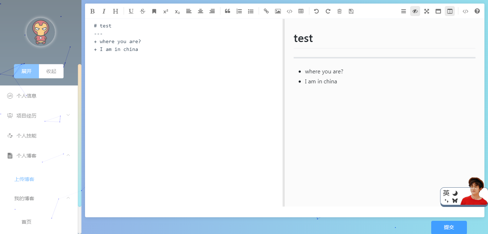

# symbol_me

## Project setup
```
npm install
```

### Compiles and hot-reloads for development
```
npm run serve
```

### Compiles and minifies for production
```
npm run build
```

### Lints and fixes files
```
npm run lint
```

### 特色
1. 界面较为美观，并可自定义自己的简历信息，包括个人信息、就学经历、项目经历、个人技能信息
2. 项目信息存储在mongodb数据库，大文件用gltf存储，后台服务程序由express搭建。[项目地址:https://github.com/Longbao521/symbolMeServer](https://github.com/Longbao521/symbolMeServer)
3. 项目包含多个动画，有animate.css库，也有自定义的动画，供大家参考
4. 项目支持markdown语言，支持博客的编辑预览功能，支持上传功能，上传后的博客保存在数据库中，并实时更新在自己的博客首页上，可供大家记录自己所学
5. 项目用到了vue项目常用的一些工具，如vue-cli脚手架搭建项目，element-ui构建基础组件样式等
6. 项目会一直维护完善，并会推出小程序版(mpVue,[项目地址:https://github.com/Longbao521/mpvue](https://github.com/Longbao521/mpvue))以及桌面版(Electron),如果可以会继续研究Flutter，开发跨平台应用程序，敬请期待
7. 项目代码严格遵守ESLint规范
8. 项目布局大部分采用了flex布局

### 技术栈
Vue、Vue-CLI、Axios、LESS、Element-UI、Animate、ESLint

### 遇到的问题
+ **v-html中标签样式选择器的问题**
 如果在template中写的标签可以在style scoped中定义样式，但是在v-html中的标签，则无法在该区域定义相应的样式，有以下几种解决方案:
    - 去掉style的scoped，在全局样式表定义标签的样式，不推荐使用，因为会影响不同组件内元素样式
    - 使用/deep/(LESS 、SCSS)或>>>(CSS)深层选择器
    - 在updated生命周期中，js动态配置样式
+ **v-for循环中如何为每一个按钮绑定不同的函数，为何不能再data中加一个函数**
    - 在methods中添加一个类路由函数，v-for中每一个元素包含一个method字段，指定要触发的函数，此时则可指定@click为该路由函数，并把method字段传入，由路由函数来触发相应的函数，实现View层与Model层的绑定
+ **vue中针对子组件进行设置样式**
这个与第一个问题很相似，猜测vue中对v-html中内容的处理方式也是对它动态创建一个子组件，原理很简单，父组件无法对子组件中元素修改样式，**这个在我们使用Element-UI这种第三方库时会经常碰到**，解决方法如下：
    - 去掉style的scoped，在全局样式表定义标签的样式，不推荐使用，因为会影响不同组件内元素样式
    - 使用/deep/(LESS 、SCSS)或>>>(CSS)深层选择器

项目效果展示:







### 下一步工作
1. 完善自定义功能
2. 增加相应功能模块
3. 完善token验证
4. 推出小程序版(mpvue),桌面版(ELectron)以及跨平台(Flutter)

### 更新日志
1.0.1 利用自定义指令，实现提交按钮的防抖